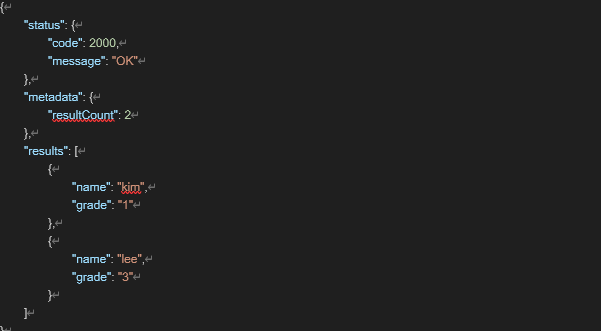
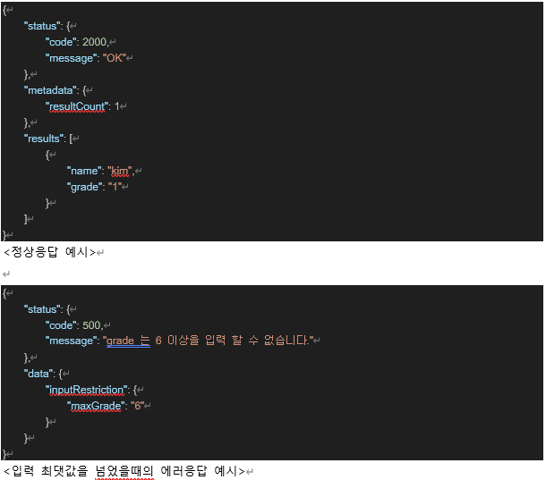
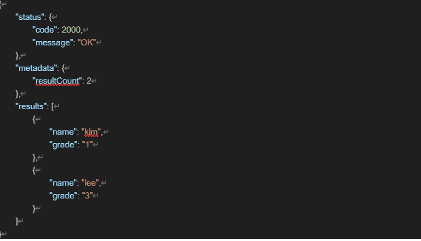
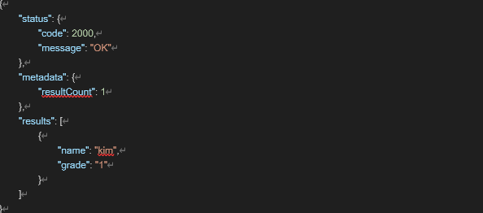

# 응답/에러모델 만들기

공통 Api 응답모델과 에러 모델을 만들고 간단한 성적 저장/조회하는 api 를 구현 해 봅시다.

응답모델의 예시는 다음과 같습니다.

그리고, 에러 응답은 다음과 같습니다.

Status.code: http status 가 아닌 서버에서 정의하는 code값이 담겨져 있어야 합니다.(정상응답에서는 항상 200)

Status.message: 정상응답시에는 “OK”, 에러 응답에서는 에러에대한 상세한 이유를 담아줍니다.

Metadata.resultCount: 정상 응답시에 나타나는 값입니다. results list 의 count 를 담아줍니다.

Results: 정상응답시에 나타나는 값입니다. 항상 list 형태로, 실제 응답으로 내주고싶은 정보가 표시됩니다.

Data: 에러 응답시에 나타나는 값으로, 에러 응답시에 frontend 에서 사용자에게 어떤 이유로 요청이 거부되었는지 메세지를 만들기 쉽게 필요한 데이터를 넣어줍니다.  ****

위의 응답(에러) 예시를 만족하는 응답을 가진 API 를 구현합니다.

## (API 요구사항)

1. 이름과 성적을 입력받아 저장하는 api
   a. 성적의 입력은 특정 값(위 에러 응답일 경우에서는 6) 이 넘었을 경우에는 에러 응답이 나타나야 합니다.

2. 입력된 성적을 조회 하는 api

   a. 성적 오름차순으로 조회가 되어야 합니다.

3. 특정 성적을 입력받아, 해당 성적의 학생만 조회하는 api

## (구현 요구사항)

1. Controller 에서 응답 모델로 만들어 주어야 합니다. 

   a.  ApiResponse<T>: 여러가지 데이터 타입(클래스) 를 result 로 넣을 수 있도록 제네릭을 사용하여서 구현 해야 합니다.  

   b. makeResponse(T result), makeResponse(List<T> results): 결과를 응답객체로 만들어주기 위한 메서드입니다. 단건과 복수건 결과 모두 응답 객체로 만들어 줄 수 있도록 두개 모두 구현 해야 합니다.

2. 에러응답을 만들기 위해서는 @ExceptionHander 를 사용하여 exception 의 데이터를 이용해야 합니다.

3. exceptionHander 에서 응답모델을 만들때 필요한 데이터가 포함시킬 수 있는 customException 을 구현 해야 합니다.  
   a. ex. CustomException(ErrorCode, massge, data) - ErrorCode 는 enum 으로 정의 합니다.

    - ErrorCode 는 enum 으로 정의 합니다.

(수행기간)

●	5일

(결과물)

●	해당 응답/에러 모델을 만든 코드